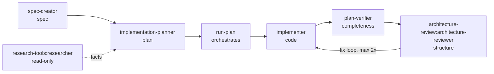

# SDD Engineering

Spec-Driven Development for Claude Code: a small set of focused, single-
responsibility agents that carry a change from an idea to verified,
structurally-reviewed code — `Spec → Plan → Implement → Verify → Review`.
Each stage is a subagent with least-privilege tools; you compose only the
stages a given change needs.

## Dependencies — what this plugin builds on

`sdd-engineering` doesn't ship every skill/agent it uses. It depends on
three sibling plugins in this marketplace, installed automatically:

| Plugin | Supplies |
| --- | --- |
| [`engineering-paved-path`](../engineering-paved-path/README.md) | The shared engineering-practice skills every agent below loads — React, component architecture, layered/hexagonal backend architecture, testing, security, diagrams — namespaced `engineering-paved-path:<skill>` |
| [`research-tools`](../research-tools/README.md) | The read-only `researcher` agent, for when a planning/implementation step needs a focused fact-finding pass |
| [`architecture-review`](../architecture-review/README.md) | The `architecture-reviewer` agent — the structural-soundness check `run-plan` runs after every wave of implementers |

## Catalog

| Component | Kind | Model | Tools | Role |
| --- | --- | --- | --- | --- |
| `spec-creator` | agent | opus | Read, Grep, Glob, WebSearch, WebFetch, Write, Edit, Agent, AskUserQuestion, Context7 | Writes Spec-Driven Development specs. Interviews the requester with EARS-based clarifying questions before writing anything, then writes exactly one file to `/specs/SPEC-NN-slug.md`. Restricted to `/specs/**` and `/design/**` — cannot touch application code. |
| `implementation-planner` | agent | opus | Read, Write, Edit, Grep, Glob, WebSearch, WebFetch | Read-only architect — produces a structured **Implementation Plan** before non-trivial coding, never a specification. Checks requirements for completeness, asks multi-agent vs. single-agent execution mode, maps the target repo's real modules, applies layered-architecture, and breaks work into tasks that each name the skills the implementer must load. |
| `implementer` | agent | sonnet · worktree isolation optional | Read, Edit, Write, Bash, Grep, Glob, Skill | Executes **one** plan task (backend or UI); runs in the current working tree by default, or in its own git worktree if the orchestrator opts into isolation for parallel runs. Loads domain-specific skills, iterates until the touched package's *existing* tests + type-check pass. Never writes tests. Self-review is limited to the code it wrote. |
| `plan-verifier` | agent | opus | Read, Grep, Glob, Bash *(read-only)* | Read-only **completeness** audit — verifies every plan/requirement item is actually built. Builds a requirement→`path:line` traceability matrix (Implemented / Partial / Missing / Cannot-verify) and reports gaps honestly. Not a quality reviewer. |
| `run-plan` | skill, `/sdd-engineering:run-plan` | — | Read, Grep, Glob, Bash, Agent | Orchestrates Implement → Verify → Review for an already-written plan: dispatches `implementer` waves, runs `plan-verifier`, runs `architecture-review:architecture-reviewer`, and auto-fixes Critical/High findings for up to 2 iterations. |
| `retro` | skill, `/sdd-engineering:retro` | — | Read, Bash, Glob, Grep, Write, Edit | Manual, on-demand analysis of a just-finished pipeline run — tokens, cache-hit rate, tool-calls, parallelism, including nested subagent transcripts — appended as one row to `docs/retros/ledger.md`. |

## The full lifecycle



- **Write agents** (touch files): `spec-creator` (writes only `/specs/**`
  and `/design/**`, never application code), `implementer` (code).
  `implementer` runs in the current working tree by default and only gets
  its own worktree when the orchestrator opts into isolation for a given
  run (needed for safe parallel dispatch, skippable in sequential mode).
- **Read-only agents** (no Edit/Write): `implementation-planner`,
  `plan-verifier`. `plan-verifier` keeps `Bash` but for **read-only evidence
  gathering only** (type-checks, tests, `git log`) — never mutation.
- **Division of labour among the checkers:** `plan-verifier` asks *"was
  every requirement built?"* (completeness), `architecture-review`'s
  `architecture-reviewer` asks *"is it in the right place, dependencies
  pointing the right way?"* (structure). They deliberately don't overlap.
  Line-level findings across the whole branch (naming, missing null checks)
  are not covered by any agent in this pipeline — `implementer`'s Step 5
  self-review only covers its own task's diff. Run a code-review tool by
  hand before opening the PR if you want that gate; it is not part of the
  automatic chain here.
- **Testing** is deliberately out of scope for this plugin — no
  `implementer` writes or extends tests, and `run-plan` never dispatches a
  test-writing step. Add test coverage yourself, or wire in your own
  test-authoring tool.

## How the pieces work together

`implementation-planner` and `implementer` form an **orchestrator-workers**
pipeline, run through `run-plan`:

1. **Plan** — `implementation-planner` checks the requirements for
   completeness (asking clarifying questions and offering recommendations
   where needed), confirms with the user whether to run multi-agent or
   single-agent, explores the target repo (read-only) to establish its real
   module map, applies `engineering-paved-path:layered-architecture`, and
   emits an Implementation Plan: 15–40 discrete tasks, each tagged with its
   owned files, the skills to load, and (in multi-agent mode) a `[P]` marker
   when it touches files disjoint from other tasks (i.e. safe to
   parallelize).
2. **Implement** — `run-plan` dispatches one `implementer` per task. Tasks
   marked `[P]` run in parallel; each implementer *can* get its own git
   worktree if the user opts into worktree isolation for this run, so
   parallel runs can't clobber each other's files on disk (off by default —
   `run-plan` asks before dispatching). Each implementer loads the skills the
   plan assigned, writes the code, and loops on tests + type-check until
   green.
3. **Verify & Review** — once every task is merged, `run-plan` runs
   `plan-verifier` for completeness, then `architecture-review:architecture-reviewer`
   for structure, auto-fixing `Critical`/`High` findings for up to 2
   iterations before handing control back.

The planner deliberately embeds the **full skills matrix**, so every
practice the implementer will apply is decided up front, at planning time.

## Orchestration protocol — waves and merging

`run-plan` is the orchestrator. It:

1. Parses the plan's `Task breakdown` into a dependency graph from each
   task's `(depends on: ...)`.
2. Groups tasks into **waves**: a wave is the maximal set of tasks whose
   dependencies are already merged. `[P]`-tagged tasks in the same wave are
   dispatched as **multiple `Agent` calls in a single message** (true
   parallelism); a non-`[P]` task is its own wave of one.
3. After a wave's agents return, checks each report's
   type-check/tests: PASS before proceeding — a reported `FAIL`/`blocked`
   stops that task's branch from being merged.
4. **Merges each task's worktree branch** into the plan's integration
   branch (one `git merge` per task, sequentially) — only applies when
   worktree isolation was used for the run; otherwise implementers already
   worked directly in the integration branch's working tree and there's
   nothing to merge. `[P]` tasks were scoped to disjoint files by the
   planner, so a merge should be a clean fast-forward — a real conflict
   means the plan under-scoped `[P]`, not a normal outcome.
5. Only starts the next wave from the updated integration branch.
6. Once all waves are merged, runs `plan-verifier`, then
   `architecture-review:architecture-reviewer` — completeness before
   structure, as above.

## Skills routing (shared by `implementation-planner` and `implementer`)

Both agents route skills by the files a task touches. This is a starting
point — adjust it to your project's actual stack:

| Files touched | Skills |
| --- | --- |
| Backend/service logic | your framework's best-practices skill, `engineering-paved-path:layered-architecture`, `engineering-paved-path:security`, a type-safety skill if installed |
| DB schema, migrations | your DB/ORM's pattern skills, if installed |
| Shared data contracts | a type-safety skill if installed |
| Pure domain logic | `engineering-paved-path:layered-architecture`, a type-safety skill if installed |
| UI code | `engineering-paved-path:react-best-practices`, `engineering-paved-path:react-component-architecture`, your meta-framework's best-practices skill if installed, `engineering-paved-path:security` |

## Using it

```
/plugin marketplace add ./
/plugin install sdd-engineering@seasoned-ai-marketplace
```

Then, for a new feature:

```
1. Delegate to spec-creator to interview you and write specs/SPEC-01-my-feature.md
2. Delegate to implementation-planner, pointing it at that spec
3. Run /sdd-engineering:run-plan with the resulting docs/plan/SPEC-01-my-feature.md
4. Optionally run /sdd-engineering:retro afterward to see how the pipeline performed
```

## Provenance

Generalized from a project-specific Spec-Driven Development agent set that
assumed a fixed 5-package monorepo layout and one concrete stack (a
particular web framework, ORM, and validation library). All four agents,
`run-plan`, and `retro` had their module-map and skills-matrix assumptions
replaced with runtime inputs — see this plugin's `CHANGELOG.md` and
`docs/spec/sdd-engineering-extraction.md` in the marketplace root for the
full extraction rationale. `test-writer`, `doc-writer`, and
`architecture-reviewer-lite` from the source project were **not** carried
over — out of scope for this pass.
